### DDD-2025-Group10
Jérémy Martin; Artem Sadoviy; Nicholas Vos

# Goldilocks Worlds

### Visualisation

#### Link to the prototype or website
https://jerem-marti.github.io/DDD-2025-Group10/

### Abstract
This project explores which known exoplanets could be viable homes for humans. Using the NASA Exoplanet Archive, we filter the composite PSCompPars table to find planets that are roughly Earth-sized, receive an Earth-like amount of stellar energy and orbit “normal” stars. Where insolation is missing, we reconstruct it from stellar luminosity and orbital parameters, and compute surface gravity from mass and radius. The resulting subset is visualised as small multiples, comparing “Goldilocks” worlds across star types and distances from Earth.

---

### Protocol Diagram
#### Indian Journey

```mermaid
flowchart TB
    %% ROOT TOPIC
    root_topic["Alien existence and perception:<br/>data imaginaries of Outer Space"]
    
    %% EXPLORED TOPIC - HINDU ALIENS (LEFT BRANCH - NOT REALIZED)
    rq_hindu(["How does the Hindu religious tradition<br/>where certain deities are interpreted as ancient aliens<br/>shape the widespread belief in India that<br/>extraterrestrials live among us?"])
    
    a_image_search{"Action:<br/>Image search<br/>VPN + Hindi terms"}
    tool_google_images(("Tool:<br/>Google Images and VPN"))
    
    data_autonomous[("Dataset:<br/>10 images of aliens<br/>chosen autonomously")]
    data_first_10[("Dataset:<br/>First 10 alien images<br/>from Google Images")]
    
    a_decompose_auto{"Action:<br/>Decompose images into sub-images<br/>using Trace Contour filter"}
    a_decompose_first{"Action:<br/>Decompose images into sub-images<br/>using Trace Contour filter"}
    
    tool_photoshop_auto(("Tool:<br/>Photoshop"))
    tool_photoshop_first(("Tool:<br/>Photoshop"))
    
    decomposed_auto[/25 sub-images<br/>per source image\]
    decomposed_first[/25 sub-images<br/>per source image\]
    
    tool_ae_auto(("Tool:<br/>After Effects"))
    tool_ae_first(("Tool:<br/>After Effects"))
    
    viz_video_auto[["Video visualization:<br/>Sequences of<br/>decomposed images"]]
    viz_video_first[["Video visualization:<br/>Sequences of<br/>decomposed images"]]
    
    %% REALIZED TOPIC - EXOPLANETS (RIGHT BRANCH)
    topic["Topic: Human-habitable exoplanets"]
    
    %% RESEARCH QUESTIONS
    rq1(["RQ1: Where in NASA's exoplanet catalogue<br/>are planets that could be human-habitable?"])
    rq2(["RQ2: How much do filters and human comfort<br/>criteria shrink this list?"])
    rq3(["RQ3: How are habitable exoplanets represented<br/>in culture - posters, films, books?"])
    
    %% ACTION 1: RESEARCH DATA
    a_research{"Action:<br/>Research of data"}
    tool_chatgpt_research(("Tool:<br/>ChatGPT 5.1 Extended Thinking"))
    
    %% ACTION 2: SELECT DATASET
    a_select{"Action:<br/>Select main dataset"}
    tool_nasa(("Tool:<br/>NASA Exoplanet Archive UI"))
    dataset_main[("Dataset:<br/>NASA Exoplanet Archive<br/>PSCompPars table")]
    
    %% ACTION 3: IMPORT AND CLEAN
    a_import{"Action:<br/>Import and clean data"}
    tool_sheets(("Tool:<br/>Google Spreadsheets"))
    col_name[/pl_name\]
    col_rade[/pl_rade\]
    col_bmasse[/pl_bmasse\]
    col_insol[/pl_insol\]
    col_teff[/st_teff\]
    col_rad[/st_rad\]
    col_spectype[/st_spectype\]
    col_distance[/sy_dist\]
    
    %% ACTION 4: DERIVE QUANTITIES
    a_derive{"Action:<br/>Compute derived quantities"}
    col_insol_merged[/pl_insol_merged\]
    col_g_rel[/pl_g_rel\]
    
    %% ACTION 5: FILTER STAR-PLANET HABITABILITY
    a_filter_star{"Action:<br/>Filter for star-planet habitability"}
    sources_rocky["Sources:<br/>PHL Habitable Exoplanets Catalog,<br/>Wikipedia potentially habitable criteria"]
    sources_hz["Sources:<br/>Kopparapu 2013 Habitable Zones,<br/>NASA Habitable Zone,<br/>Rushby 2013 HZ Lifetimes"]
    col_rocky[/pl_is_rocky_size\]
    col_hz_opt[/pl_in_optimistic_habitable_zone_insolation\]
    col_hz_cons[/pl_in_conservative_habitable_zone_insolation\]
    col_st_temp[/st_2600_7200K\]
    cols_hz[/Filtered data:<br/>rocky, Earth-sized planets<br/>in stellar habitable zone<br/>around main sequence stars\]
    
    %% ACTION 6: FILTER HUMAN COMFORT
    a_filter_human{"Action:<br/>Apply human centered criteria"}
    sources_gravity["Sources:<br/>Levenson 2023 Max gravity,<br/>Goswami 2021 Altered gravity,<br/>NASA Human Body in Space"]
    col_gravity[/pl_is_gravity_comfortable\]
    col_has_data[/has_data\]
    col_opt_candidate[/pl_is_optimistic_candidate\]
    col_cons_candidate[/pl_is_conservative_candidate\]
    cols_final[/Final candidate list:<br/>comfortable gravity 0.5-1.5g,<br/>complete data\]
    
    %% ACTION 7: DESIGN VISUALIZATION IDEA
    a_design{"Action:<br/>Sketch visual concepts and narrative flow"}
    tool_sketch(("Tool:<br/>Sketching"))
    tool_chatgpt_design(("Tool:<br/>ChatGPT 5.1 Extended Thinking"))
    concept[/"Visual concept:<br/>Multi-step filtering story<br/>with galaxy map, scatter plots,<br/>and individual planet cards"/]
    
    %% ACTION 8: DEFINE TECHNICAL APPROACH
    a_frameworks{"Action:<br/>Choose visualization libraries and technologies"}
    tool_chatgpt_frameworks(("Tool:<br/>ChatGPT 5.1 Extended Thinking"))
    frameworks[/"Technical choices:<br/>D3.js for data binding and scales,<br/>Canvas for galaxy view performance,<br/>SVG for interactive charts,<br/>Vanilla JS for simplicity"/]
    
    %% ACTION 9: ORGANIZE PROJECT STRUCTURE
    a_structure{"Action:<br/>Plan application architecture and file organization"}
    tool_chatgpt_structure(("Tool:<br/>ChatGPT 5.1 Extended Thinking"))
    code_structure[/"Project structure:<br/>Separate modules for data loading,<br/>scene configuration, view rendering,<br/>UI controls, and styling"/]
    
    %% ACTION 10: BUILD INTERACTIVE COMPONENTS
    a_implement{"Action:<br/>Implement interactive features and animations"}
    tool_claude(("Tool:<br/>Claude Sonnet 4.5"))
    components[/"Implementation:<br/>Galaxy navigation with zoom,<br/>Scatter plot filtering transitions,<br/>Planet orbit animations,<br/>Sidebar narrative progression,<br/>Citation tooltips"/]
    
    %% ACTION 11: FINALIZE AND POLISH
    a_finalize{"Action:<br/>Refine visual design and user experience"}
    tool_claude_final(("Tool:<br/>Claude Sonnet 4.5"))
    viz["Interactive data story:<br/>Galaxy of Filters<br/>Progressive filtering visualization<br/>from thousands of systems<br/>to handful of habitable candidates"]
    
    %% INSIGHTS
    insight{{"Insight / findings:<br/>Filtering from thousands of exoplanets<br/>to potentially habitable candidates<br/>reveals how restrictive habitability criteria are<br/>and highlights data completeness challenges"}}
    
    %% FLOWS
    %% Hindu aliens branch (explored but not realized)
    root_topic -.-> rq_hindu
    rq_hindu -.-> a_image_search
    a_image_search -.-> tool_google_images
    tool_google_images -.-> data_autonomous
    tool_google_images -.-> data_first_10
    
    data_autonomous -.-> tool_photoshop_auto
    tool_photoshop_auto -.-> a_decompose_auto
    a_decompose_auto -.-> decomposed_auto
    decomposed_auto -.-> tool_ae_auto
    tool_ae_auto -.-> viz_video_auto
    
    data_first_10 -.-> tool_photoshop_first
    tool_photoshop_first -.-> a_decompose_first
    a_decompose_first -.-> decomposed_first
    decomposed_first -.-> tool_ae_first
    tool_ae_first -.-> viz_video_first
    
    %% Exoplanets branch (realized)
    root_topic --> topic
    topic --> rq1
    topic --> rq2
    topic -.-> rq3
    
    rq2 --> a_research
    a_research --> tool_chatgpt_research
    tool_chatgpt_research --> a_select
    
    a_select --> tool_nasa
    tool_nasa --> dataset_main
    
    dataset_main --> a_import
    a_import --> tool_sheets
    tool_sheets --> col_name
    tool_sheets --> col_rade
    tool_sheets --> col_bmasse
    tool_sheets --> col_insol
    tool_sheets --> col_teff
    tool_sheets --> col_rad
    tool_sheets --> col_spectype
    tool_sheets --> col_distance
    
    col_name --> a_derive
    col_rade --> a_derive
    col_bmasse --> a_derive
    col_insol --> a_derive
    col_teff --> a_derive
    col_rad --> a_derive
    col_spectype --> a_derive
    col_distance --> a_derive
    a_derive --> col_insol_merged
    a_derive --> col_g_rel
    
    col_insol_merged --> a_filter_star
    col_g_rel --> a_filter_star
    col_rade --> a_filter_star
    col_teff --> a_filter_star
    a_filter_star --> col_rocky
    a_filter_star --> col_hz_opt
    a_filter_star --> col_hz_cons
    a_filter_star --> col_st_temp
    sources_rocky -.-> a_filter_star
    sources_hz -.-> a_filter_star
    col_rocky --> cols_hz
    col_hz_opt --> cols_hz
    col_hz_cons --> cols_hz
    col_st_temp --> cols_hz
    
    cols_hz --> a_filter_human
    col_g_rel --> a_filter_human
    sources_gravity -.-> a_filter_human
    a_filter_human --> col_gravity
    a_filter_human --> col_has_data
    a_filter_human --> col_opt_candidate
    a_filter_human --> col_cons_candidate
    col_gravity --> cols_final
    col_has_data --> cols_final
    col_opt_candidate --> cols_final
    col_cons_candidate --> cols_final
    
    cols_final --> a_design
    a_design --> tool_sketch
    a_design --> tool_chatgpt_design
    tool_sketch --> concept
    tool_chatgpt_design --> concept
    
    concept --> a_frameworks
    a_frameworks --> tool_chatgpt_frameworks
    tool_chatgpt_frameworks --> frameworks
    
    frameworks --> a_structure
    a_structure --> tool_chatgpt_structure
    tool_chatgpt_structure --> code_structure
    
    code_structure --> a_implement
    a_implement --> tool_claude
    tool_claude --> components
    
    components --> a_finalize
    a_finalize --> tool_claude_final
    tool_claude_final --> viz
    
    viz --> insight
    
    %% BRANCH THAT WAS CONSIDERED BUT NOT REALISED
    a_culture{"Action:<br/>Collect cultural material"}
    dataset_culture[("Dataset:<br/>NASA/JPL posters,<br/>films, books about<br/>habitable worlds")]
    a_compare{"Action:<br/>Compare dream worlds<br/>with data driven<br/>habitable planets"}
    viz_culture["Planned visualisation:<br/>science vs culture juxtaposition"]
    
    rq3 -.-> a_culture
    a_culture -.-> dataset_culture
    dataset_culture -.-> a_compare
    a_compare -.-> viz_culture
    
    %% STYLES
    classDef considered stroke-dasharray: 5 5, stroke-width:2px, fill:#3d3d3d, stroke:#888888, color:#e0e0e0
    classDef explored stroke-dasharray: 5 5, stroke-width:2px, fill:#2d2d2d, stroke:#666666, color:#cccccc
    
    class rq3,a_culture,dataset_culture,a_compare,viz_culture considered
    class rq_hindu,a_image_search,tool_google_images,data_autonomous,data_first_10,tool_photoshop_auto,tool_photoshop_first,a_decompose_auto,a_decompose_first,decomposed_auto,decomposed_first,tool_ae_auto,tool_ae_first,viz_video_auto,viz_video_first explored
```

---

### What topic does the project address?

The project investigates how we can define and visualise “human-habitable” exoplanets using astrophysical data. Instead of focusing on purely speculative alien life, we restrict ourselves to planets that could plausibly host humans: rocky, with Earth-like stellar flux, orbiting long-lived stars and with surface gravity in a tolerable range. The visualisation treats the NASA exoplanet catalogue as a cultural artefact: we compare these “Goldilocks” worlds to Earth and to each other, across different star types and distances from our solar system.

---

### What data have you considered?

We work exclusively with the NASA Exoplanet Archive, specifically the **PSCompPars** (Planetary Systems Composite Parameters) table. PSCompPars is a composite table with one row per confirmed exoplanet and a more complete, though not always perfectly self-consistent, set of parameters, designed for statistical studies of the exoplanet population.

Format:

* Exported as **CSV** from the archive interface.
* Each row corresponds to a confirmed exoplanet.
* Columns include planetary, stellar and system parameters as well as our own derived fields.

**Key original columns used**

* **Planet identity and system context**

  * `pl_name`: planet name
  * `hostname`: host star name
  * `sy_snum`: number of stars in the system
  * `sy_pnum`: number of planets in the system
  * `cb_flag`: circumbinary flag

* **Planet physical properties**

  * `pl_rade`: radius in Earth radii
  * `pl_bmasse`: mass in Earth masses
  * `pl_dens`: bulk density (sanity check for rocky composition)
  * `pl_insol`: insolation flux in Earth units (when available)
  * `pl_eqt`: equilibrium temperature
  * `pl_orbper`: orbital period (days)
  * `pl_orbsmax`: semi major axis (AU)
  * `pl_orbeccen`: orbital eccentricity

* **Stellar environment**

  * `st_lum`: stellar luminosity (log L/L⊙)
  * `st_mass`: stellar mass (M⊙)
  * `st_teff`: effective temperature (K)
  * `st_spectype`: spectral type (used for grouping and labels)
  * `st_age`: stellar age (optional context)
  * `st_met`, `st_metratio`: metallicity (optional context)

* **Observational context**

  * `sy_dist`: distance from Earth (pc)
  * `tran_flag`, `rv_flag`, `ima_flag`, `micro_flag`: detection method flags
  * `discoverymethod`: discovery method label
  * `disc_year`: discovery year
  * `disc_facility`, `disc_telescope`: mission and telescope names

**Derived columns created in this project**

To make the dataset usable for a “human-habitable” filter, we create:

* `pl_insol_est`: reconstructed insolation when `pl_insol` is missing. We use stellar luminosity (`st_lum`) and orbital distance (`pl_orbsmax`), or, if needed, orbital period (`pl_orbper`) and stellar mass (`st_mass`) via Kepler’s third law and the inverse-square law for flux, consistent with habitable-zone work that uses stellar flux rather than equilibrium temperature as the main variable.
* `pl_insol_merged`: final insolation value used for filtering, equal to `pl_insol` if present, otherwise `pl_insol_est`.
* `pl_insol_source`: provenance flag (`archive`, `estimated`, `missing`).
* `pl_g_rel`: surface gravity relative to Earth, computed as `pl_bmasse / pl_rade^2`.
* `pl_g_band`: gravity band category (`low`, `ok`, `high`, `unknown`) to summarise “human comfort”.

We also add boolean flags for each criterion:

* `pl_is_rocky_size` – radius in a “rocky” range (0.5–1.6 R⊕ or similar), inspired by the **Habitable Worlds Catalog** (ex Habitable Exoplanets Catalog) conservative sample.
* `pl_in_optimistic_habitable-zone-insolation` – insolation between 0.32 and 1.78 S⊕ (optimistic habitable zone).
* `pl_in_conservative_habitable-zone-insolation` – insolation between 0.35 and 1.04 S⊕ (conservative habitable zone).
* `st_2600–7200K` – host star effective temperature between 2600 and 7200 K, corresponding roughly to main-sequence M to F stars.
* `pl_is_gravity_comfortable` – surface gravity between 0.5 and 1.5 g, a design band informed by studies on human adaptation to altered gravity and hypotheses on maximum long-term tolerable gravity.
* `has_data` – all key parameters for filtering (radius, insolation_merged, Teff, gravity) are present.
* `pl_is_optimistic_candidate` – planet passes all criteria for the optimistic sample (rocky size, optimistic HZ, good star temperature, comfortable gravity, has_data).
* `pl_is_conservative_candidate` – same, but with conservative HZ limits.

These columns turn the scientific catalogue into a more legible dataset for visualisation and for discussing “human-habitable” worlds.

#### Link to the dataset

NASA Exoplanet Archive – Planetary Systems Composite Parameters (PSCompPars) table:
[https://exoplanetarchive.ipac.caltech.edu/](https://exoplanetarchive.ipac.caltech.edu/)

---

### What does the visualisation show?

The visualization is designed to bring the user through a journey on identifying habitable hexoplanets starting from step 1 where known planets in our galaxy are presented all the way through step 7 where the most habitable planet are shown and are compared to Earth.

Three key readings:

* **Shortlist of “Goldilocks” worlds**
  By combining radius, insolation, stellar temperature and surface gravity, we build “optimistic” and “conservative” sets of candidate planets. Among all 6 thousand planets, only 12 conservative planets would be suitable for human life.

* **Diversity across star types and distances**
  Panels can be grouped by host star class (for example M, K, G, F) and by distance from Earth. This reveals how our best candidates are distributed in terms of stellar environment and proximity, and highlights the trade-off between habitability and observability.

* **Comparison with Earth and human comfort**
  Each panel includes Earth as a visual reference. Planet markers encode surface gravity and insolation, making it easy to see which worlds are too light, too heavy, too cold or too hot for long-term human life, even if they lie inside the classical habitable zone defined by stellar flux.

---

### Sources and references

| Source | Type | Role in project |
| ------ | ---- | ----------------|
| [NASA Exoplanet Archive – PS and PSCompPars documentation](https://exoplanetarchive.ipac.caltech.edu/docs/pscp_about.html) | Official database documentation | Explains the difference between the Planetary Systems (ps) and Planetary Systems Composite Parameters (PSCompPars) tables and why PSCompPars is recommended for statistical work. Justifies switching from PS to PSCompPars and using its parameters as our core dataset. |
| [NASA Exoplanet Archive – PSCompPars web table](https://exoplanetarchive.ipac.caltech.edu/cgi-bin/TblView/nph-tblView?app=ExoTbls&config=PSCompPars) | Data table | Primary source of planetary and stellar parameters (radius, mass, insolation, Teff, luminosity, etc.). All rows in our project come from this table, exported as CSV. |
| [Kopparapu et al., “Habitable Zones around Main-Sequence Stars: New Estimates”](https://ui.adsabs.harvard.edu/abs/2013ApJ...765..131K/abstract) | Scientific paper on habitable zones | Provides updated habitable-zone flux limits in units of Earth’s insolation: early Mars (~0.32), maximum greenhouse (~0.35), runaway greenhouse (~1.04), recent Venus (~1.78). We use these as conservative and optimistic insolation boundaries. |
| [NASA – “The Habitable Zone”](https://science.nasa.gov/exoplanets/habitable-zone/) | Outreach science page | Defines the habitable zone as the region around a star where liquid water could exist on a planet’s surface and introduces the “Goldilocks zone” metaphor used in our framing. |
| [Planetary Habitability Laboratory – Habitable Exoplanets Catalog / Habitable Worlds Catalog](https://phl.upr.edu/hec) | Catalog of potentially habitable exoplanets | Provides example criteria for rocky, potentially habitable planets (e.g. 0.5 < R ≤ 1.6 R⊕ or 0.1 < M ≤ 3 M⊕) and for conservative vs optimistic samples. Inspires our rocky size cut and the idea of separate optimistic and conservative candidate sets. |
| [Rushby et al. 2013 – “Habitable Zone Lifetimes of Exoplanets around Main Sequence Stars”](https://journals.sagepub.com/doi/10.1089/ast.2012.0938) and [Gillmann et al. 2024 – “Interior Controls on the Habitability of Rocky Planets”](https://arxiv.org/abs/2403.17630) | Scientific reviews | Give broader context on planetary habitability and the time evolution of habitable zones around main-sequence stars. Support our focus on main-sequence F–M stars and on long-term habitability rather than instantaneous conditions. |
| [Goswami 2021 – “Human physiology adaptation to altered gravity environments”](https://www.sciencedirect.com/science/article/pii/S0094576521004434) and [Levenson 2023 – “The Maximum Tolerable Gravity for Human Colonies”](https://bis-space.com/shop/product/jbis-076-08-0279/) | Scientific and technical literature on gravity tolerance | Inform our design choice of a “comfortable” gravity band for humans roughly between 0.5 g and 1.5 g, acknowledging that very low gravity leads to deconditioning and high gravity challenges cardiovascular and musculoskeletal systems over long timescales. |
| [High-G centrifuge training and G-tolerance references](https://indjaerospacemed.com/high-g-centrifuge-training/) | Applied physiology / reference | Provide intuitive ranges and examples of human performance at different G-levels (pilots, centrifuge tests), reinforcing that sustained gravities significantly above 1 g quickly become problematic, which supports our upper bound choice. |

