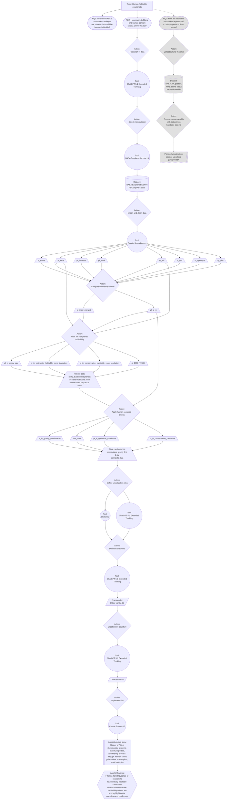

```mermaid
flowchart TB
    %% TOPIC
    topic["Topic: Human-habitable exoplanets"]
    
    %% RESEARCH QUESTIONS
    rq1(["RQ1: Where in NASA's exoplanet catalogue<br/>are planets that could be human-habitable?"])
    rq2(["RQ2: How much do filters and human comfort<br/>criteria shrink this list?"])
    rq3(["RQ3: How are habitable exoplanets represented<br/>in culture - posters, films, books?"])
    
    %% ACTION 1: RESEARCH DATA
    a_research{"Action:<br/>Research of data"}
    tool_chatgpt_research(("Tool:<br/>ChatGPT 5.1 Extended Thinking"))
    
    %% ACTION 2: SELECT DATASET
    a_select{"Action:<br/>Select main dataset"}
    tool_nasa(("Tool:<br/>NASA Exoplanet Archive UI"))
    dataset_main[("Dataset:<br/>NASA Exoplanet Archive<br/>PSCompPars table")]
    
    %% ACTION 3: IMPORT AND CLEAN
    a_import{"Action:<br/>Import and clean data"}
    tool_sheets(("Tool:<br/>Google Spreadsheets"))
    col_name[/pl_name\]
    col_rade[/pl_rade\]
    col_bmasse[/pl_bmasse\]
    col_insol[/pl_insol\]
    col_teff[/st_teff\]
    col_rad[/st_rad\]
    col_spectype[/st_spectype\]
    col_distance[/sy_dist\]
    
    %% ACTION 4: DERIVE QUANTITIES
    a_derive{"Action:<br/>Compute derived quantities"}
    col_insol_merged[/pl_insol_merged\]
    col_g_rel[/pl_g_rel\]
    
    %% ACTION 5: FILTER STAR-PLANET HABITABILITY
    a_filter_star{"Action:<br/>Filter for star-planet habitability"}
    col_rocky[/pl_is_rocky_size\]
    col_hz_opt[/pl_in_optimistic_habitable_zone_insolation\]
    col_hz_cons[/pl_in_conservative_habitable_zone_insolation\]
    col_st_temp[/st_2600_7200K\]
    cols_hz[/Filtered data:<br/>rocky, Earth-sized planets<br/>in stellar habitable zone<br/>around main sequence stars\]
    
    %% ACTION 6: FILTER HUMAN COMFORT
    a_filter_human{"Action:<br/>Apply human centered criteria"}
    col_gravity[/pl_is_gravity_comfortable\]
    col_has_data[/has_data\]
    col_opt_candidate[/pl_is_optimistic_candidate\]
    col_cons_candidate[/pl_is_conservative_candidate\]
    cols_final[/Final candidate list:<br/>comfortable gravity 0.5-1.5g,<br/>complete data\]
    
    %% ACTION 7: DESIGN VISUALIZATION IDEA
    a_design{"Action:<br/>Define visualization idea"}
    tool_sketch(("Tool:<br/>Sketching"))
    tool_chatgpt_design(("Tool:<br/>ChatGPT 5.1 Extended Thinking"))
    
    %% ACTION 8: DEFINE FRAMEWORKS
    a_frameworks{"Action:<br/>Define frameworks"}
    tool_chatgpt_frameworks(("Tool:<br/>ChatGPT 5.1 Extended Thinking"))
    frameworks[/"Frameworks:<br/>D3.js, Vanilla JS"/]
    
    %% ACTION 9: CREATE CODE STRUCTURE
    a_structure{"Action:<br/>Create code structure"}
    tool_chatgpt_structure(("Tool:<br/>ChatGPT 5.1 Extended Thinking"))
    code_structure[/"Code structure"/]
    
    %% ACTION 10: IMPLEMENT SITE
    a_implement{"Action:<br/>Implement site"}
    tool_claude(("Tool:<br/>Claude Sonnet 4.5"))
    viz[["Interactive data story:<br/>Galaxy of Filters<br/>showing star systems, planet properties,<br/>and filtering process through multiple views<br/>galaxy view, scatter plots, small multiples"]]
    
    %% INSIGHTS
    insight{{"Insight / findings:<br/>Filtering from thousands of exoplanets<br/>to potentially habitable candidates<br/>reveals how restrictive habitability criteria are<br/>and highlights data completeness challenges"}}
    
    %% MAIN FLOW
    topic --> rq1
    topic --> rq2
    topic -.-> rq3
    
    rq2 --> a_research
    a_research --> tool_chatgpt_research
    tool_chatgpt_research --> a_select
    
    a_select --> tool_nasa
    tool_nasa --> dataset_main
    
    dataset_main --> a_import
    a_import --> tool_sheets
    tool_sheets --> col_name
    tool_sheets --> col_rade
    tool_sheets --> col_bmasse
    tool_sheets --> col_insol
    tool_sheets --> col_teff
    tool_sheets --> col_rad
    tool_sheets --> col_spectype
    tool_sheets --> col_distance
    
    col_name --> a_derive
    col_rade --> a_derive
    col_bmasse --> a_derive
    col_insol --> a_derive
    col_teff --> a_derive
    col_rad --> a_derive
    col_spectype --> a_derive
    col_distance --> a_derive
    a_derive --> col_insol_merged
    a_derive --> col_g_rel
    
    col_insol_merged --> a_filter_star
    col_g_rel --> a_filter_star
    col_rade --> a_filter_star
    col_teff --> a_filter_star
    a_filter_star --> col_rocky
    a_filter_star --> col_hz_opt
    a_filter_star --> col_hz_cons
    a_filter_star --> col_st_temp
    col_rocky --> cols_hz
    col_hz_opt --> cols_hz
    col_hz_cons --> cols_hz
    col_st_temp --> cols_hz
    
    cols_hz --> a_filter_human
    col_g_rel --> a_filter_human
    a_filter_human --> col_gravity
    a_filter_human --> col_has_data
    a_filter_human --> col_opt_candidate
    a_filter_human --> col_cons_candidate
    col_gravity --> cols_final
    col_has_data --> cols_final
    col_opt_candidate --> cols_final
    col_cons_candidate --> cols_final
    
    cols_final --> a_design
    a_design --> tool_sketch
    a_design --> tool_chatgpt_design
    tool_sketch --> a_frameworks
    tool_chatgpt_design --> a_frameworks
    
    a_frameworks --> tool_chatgpt_frameworks
    tool_chatgpt_frameworks --> frameworks
    
    frameworks --> a_structure
    a_structure --> tool_chatgpt_structure
    tool_chatgpt_structure --> code_structure
    
    code_structure --> a_implement
    a_implement --> tool_claude
    tool_claude --> viz
    
    viz --> insight
    
    %% BRANCH THAT WAS CONSIDERED BUT NOT REALISED
    a_culture{"Action:<br/>Collect cultural material"}
    dataset_culture[("Dataset:<br/>NASA/JPL posters,<br/>films, books about<br/>habitable worlds")]
    a_compare{"Action:<br/>Compare dream worlds<br/>with data driven<br/>habitable planets"}
    viz_culture[["Planned visualisation:<br/>science vs culture juxtaposition"]]
    
    rq3 -.-> a_culture
    a_culture -.-> dataset_culture
    dataset_culture -.-> a_compare
    a_compare -.-> viz_culture
    
    %% STYLES
    classDef considered stroke-dasharray: 5 5, stroke-width:1px, fill:#e0e0e0
    class rq3,a_culture,dataset_culture,a_compare,viz_culture considered
```