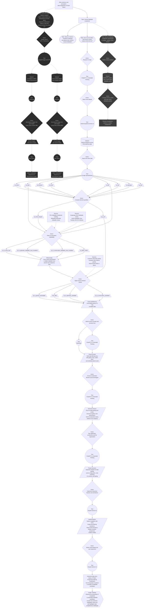

```mermaid
flowchart TB
    %% ROOT TOPIC
    root_topic["Alien existence and perception:<br/>data imaginaries of Outer Space"]
    
    %% EXPLORED TOPIC - HINDU ALIENS (LEFT BRANCH - NOT REALIZED)
    rq_hindu(["How does the Hindu religious tradition<br/>where certain deities are interpreted as ancient aliens<br/>shape the widespread belief in India that<br/>extraterrestrials live among us?"])
    
    a_image_search{"Action:<br/>Image search<br/>VPN + Hindi terms"}
    tool_google_images(("Tool:<br/>Google Images and VPN"))
    
    data_autonomous[("Dataset:<br/>10 images of aliens<br/>chosen autonomously")]
    data_first_10[("Dataset:<br/>First 10 alien images<br/>from Google Images")]
    
    a_decompose_auto{"Action:<br/>Decompose images into sub-images<br/>using Trace Contour filter"}
    a_decompose_first{"Action:<br/>Decompose images into sub-images<br/>using Trace Contour filter"}
    
    tool_photoshop_auto(("Tool:<br/>Photoshop"))
    tool_photoshop_first(("Tool:<br/>Photoshop"))
    
    decomposed_auto[/25 sub-images<br/>per source image\]
    decomposed_first[/25 sub-images<br/>per source image\]
    
    tool_ae_auto(("Tool:<br/>After Effects"))
    tool_ae_first(("Tool:<br/>After Effects"))
    
    viz_video_auto[["Video visualization:<br/>Sequences of<br/>decomposed images"]]
    viz_video_first[["Video visualization:<br/>Sequences of<br/>decomposed images"]]
    
    %% REALIZED TOPIC - EXOPLANETS (RIGHT BRANCH)
    topic["Topic: Human-habitable exoplanets"]
    
    %% RESEARCH QUESTIONS
    rq1(["RQ1: Where in NASA's exoplanet catalogue<br/>are planets that could be human-habitable?"])
    rq2(["RQ2: How much do filters and human comfort<br/>criteria shrink this list?"])
    rq3(["RQ3: How are habitable exoplanets represented<br/>in culture - posters, films, books?"])
    
    %% ACTION 1: RESEARCH DATA
    a_research{"Action:<br/>Research of data"}
    tool_chatgpt_research(("Tool:<br/>ChatGPT 5.1 Extended Thinking"))
    
    %% ACTION 2: SELECT DATASET
    a_select{"Action:<br/>Select main dataset"}
    tool_nasa(("Tool:<br/>NASA Exoplanet Archive UI"))
    dataset_main[("Dataset:<br/>NASA Exoplanet Archive<br/>PSCompPars table")]
    
    %% ACTION 3: IMPORT AND CLEAN
    a_import{"Action:<br/>Import and clean data"}
    tool_sheets(("Tool:<br/>Google Spreadsheets"))
    col_name[/pl_name\]
    col_rade[/pl_rade\]
    col_bmasse[/pl_bmasse\]
    col_insol[/pl_insol\]
    col_teff[/st_teff\]
    col_rad[/st_rad\]
    col_spectype[/st_spectype\]
    col_distance[/sy_dist\]
    
    %% ACTION 4: DERIVE QUANTITIES
    a_derive{"Action:<br/>Compute derived quantities"}
    col_insol_merged[/pl_insol_merged\]
    col_g_rel[/pl_g_rel\]
    
    %% ACTION 5: FILTER STAR-PLANET HABITABILITY
    a_filter_star{"Action:<br/>Filter for star-planet habitability"}
    sources_rocky["Sources:<br/>PHL Habitable Exoplanets Catalog,<br/>Wikipedia potentially habitable criteria"]
    sources_hz["Sources:<br/>Kopparapu 2013 Habitable Zones,<br/>NASA Habitable Zone,<br/>Rushby 2013 HZ Lifetimes"]
    col_rocky[/pl_is_rocky_size\]
    col_hz_opt[/pl_in_optimistic_habitable_zone_insolation\]
    col_hz_cons[/pl_in_conservative_habitable_zone_insolation\]
    col_st_temp[/st_2600_7200K\]
    cols_hz[/Filtered data:<br/>rocky, Earth-sized planets<br/>in stellar habitable zone<br/>around main sequence stars\]
    
    %% ACTION 6: FILTER HUMAN COMFORT
    a_filter_human{"Action:<br/>Apply human centered criteria"}
    sources_gravity["Sources:<br/>Levenson 2023 Max gravity,<br/>Goswami 2021 Altered gravity,<br/>NASA Human Body in Space"]
    col_gravity[/pl_is_gravity_comfortable\]
    col_has_data[/has_data\]
    col_opt_candidate[/pl_is_optimistic_candidate\]
    col_cons_candidate[/pl_is_conservative_candidate\]
    cols_final[/Final candidate list:<br/>comfortable gravity 0.5-1.5g,<br/>complete data\]
    
    %% ACTION 7: DESIGN VISUALIZATION IDEA
    a_design{"Action:<br/>Sketch visual concepts and narrative flow"}
    tool_sketch(("Tool:<br/>Sketching"))
    tool_chatgpt_design(("Tool:<br/>ChatGPT 5.1 Extended Thinking"))
    concept[/"Visual concept:<br/>Multi-step filtering story<br/>with galaxy map, scatter plots,<br/>and individual planet cards"/]
    
    %% ACTION 8: DEFINE TECHNICAL APPROACH
    a_frameworks{"Action:<br/>Choose visualization libraries and technologies"}
    tool_chatgpt_frameworks(("Tool:<br/>ChatGPT 5.1 Extended Thinking"))
    frameworks[/"Technical choices:<br/>D3.js for data binding and scales,<br/>Canvas for galaxy view performance,<br/>SVG for interactive charts,<br/>Vanilla JS for simplicity"/]
    
    %% ACTION 9: ORGANIZE PROJECT STRUCTURE
    a_structure{"Action:<br/>Plan application architecture and file organization"}
    tool_chatgpt_structure(("Tool:<br/>ChatGPT 5.1 Extended Thinking"))
    code_structure[/"Project structure:<br/>Separate modules for data loading,<br/>scene configuration, view rendering,<br/>UI controls, and styling"/]
    
    %% ACTION 10: BUILD INTERACTIVE COMPONENTS
    a_implement{"Action:<br/>Implement interactive features and animations"}
    tool_claude(("Tool:<br/>Claude Sonnet 4.5"))
    components[/"Implementation:<br/>Galaxy navigation with zoom,<br/>Scatter plot filtering transitions,<br/>Planet orbit animations,<br/>Sidebar narrative progression,<br/>Citation tooltips"/]
    
    %% ACTION 11: FINALIZE AND POLISH
    a_finalize{"Action:<br/>Refine visual design and user experience"}
    tool_claude_final(("Tool:<br/>Claude Sonnet 4.5"))
    viz["Interactive data story:<br/>Galaxy of Filters<br/>Progressive filtering visualization<br/>from thousands of systems<br/>to handful of habitable candidates"]
    
    %% INSIGHTS
    insight{{"Insight / findings:<br/>Filtering from thousands of exoplanets<br/>to potentially habitable candidates<br/>reveals how restrictive habitability criteria are<br/>and highlights data completeness challenges"}}
    
    %% FLOWS
    %% Hindu aliens branch (explored but not realized)
    root_topic -.-> rq_hindu
    rq_hindu -.-> a_image_search
    a_image_search -.-> tool_google_images
    tool_google_images -.-> data_autonomous
    tool_google_images -.-> data_first_10
    
    data_autonomous -.-> tool_photoshop_auto
    tool_photoshop_auto -.-> a_decompose_auto
    a_decompose_auto -.-> decomposed_auto
    decomposed_auto -.-> tool_ae_auto
    tool_ae_auto -.-> viz_video_auto
    
    data_first_10 -.-> tool_photoshop_first
    tool_photoshop_first -.-> a_decompose_first
    a_decompose_first -.-> decomposed_first
    decomposed_first -.-> tool_ae_first
    tool_ae_first -.-> viz_video_first
    
    %% Exoplanets branch (realized)
    root_topic --> topic
    topic --> rq1
    topic --> rq2
    topic -.-> rq3
    
    rq2 --> a_research
    a_research --> tool_chatgpt_research
    tool_chatgpt_research --> a_select
    
    a_select --> tool_nasa
    tool_nasa --> dataset_main
    
    dataset_main --> a_import
    a_import --> tool_sheets
    tool_sheets --> col_name
    tool_sheets --> col_rade
    tool_sheets --> col_bmasse
    tool_sheets --> col_insol
    tool_sheets --> col_teff
    tool_sheets --> col_rad
    tool_sheets --> col_spectype
    tool_sheets --> col_distance
    
    col_name --> a_derive
    col_rade --> a_derive
    col_bmasse --> a_derive
    col_insol --> a_derive
    col_teff --> a_derive
    col_rad --> a_derive
    col_spectype --> a_derive
    col_distance --> a_derive
    a_derive --> col_insol_merged
    a_derive --> col_g_rel
    
    col_insol_merged --> a_filter_star
    col_g_rel --> a_filter_star
    col_rade --> a_filter_star
    col_teff --> a_filter_star
    a_filter_star --> col_rocky
    a_filter_star --> col_hz_opt
    a_filter_star --> col_hz_cons
    a_filter_star --> col_st_temp
    sources_rocky -.-> a_filter_star
    sources_hz -.-> a_filter_star
    col_rocky --> cols_hz
    col_hz_opt --> cols_hz
    col_hz_cons --> cols_hz
    col_st_temp --> cols_hz
    
    cols_hz --> a_filter_human
    col_g_rel --> a_filter_human
    sources_gravity -.-> a_filter_human
    a_filter_human --> col_gravity
    a_filter_human --> col_has_data
    a_filter_human --> col_opt_candidate
    a_filter_human --> col_cons_candidate
    col_gravity --> cols_final
    col_has_data --> cols_final
    col_opt_candidate --> cols_final
    col_cons_candidate --> cols_final
    
    cols_final --> a_design
    a_design --> tool_sketch
    a_design --> tool_chatgpt_design
    tool_sketch --> concept
    tool_chatgpt_design --> concept
    
    concept --> a_frameworks
    a_frameworks --> tool_chatgpt_frameworks
    tool_chatgpt_frameworks --> frameworks
    
    frameworks --> a_structure
    a_structure --> tool_chatgpt_structure
    tool_chatgpt_structure --> code_structure
    
    code_structure --> a_implement
    a_implement --> tool_claude
    tool_claude --> components
    
    components --> a_finalize
    a_finalize --> tool_claude_final
    tool_claude_final --> viz
    
    viz --> insight
    
    %% BRANCH THAT WAS CONSIDERED BUT NOT REALISED
    a_culture{"Action:<br/>Collect cultural material"}
    dataset_culture[("Dataset:<br/>NASA/JPL posters,<br/>films, books about<br/>habitable worlds")]
    a_compare{"Action:<br/>Compare dream worlds<br/>with data driven<br/>habitable planets"}
    viz_culture["Planned visualisation:<br/>science vs culture juxtaposition"]
    
    rq3 -.-> a_culture
    a_culture -.-> dataset_culture
    dataset_culture -.-> a_compare
    a_compare -.-> viz_culture
    
    %% STYLES
    classDef considered stroke-dasharray: 5 5, stroke-width:2px, fill:#3d3d3d, stroke:#888888, color:#e0e0e0
    classDef explored stroke-dasharray: 5 5, stroke-width:2px, fill:#2d2d2d, stroke:#666666, color:#cccccc
    
    class rq3,a_culture,dataset_culture,a_compare,viz_culture considered
    class rq_hindu,a_image_search,tool_google_images,data_autonomous,data_first_10,tool_photoshop_auto,tool_photoshop_first,a_decompose_auto,a_decompose_first,decomposed_auto,decomposed_first,tool_ae_auto,tool_ae_first,viz_video_auto,viz_video_first explored
```