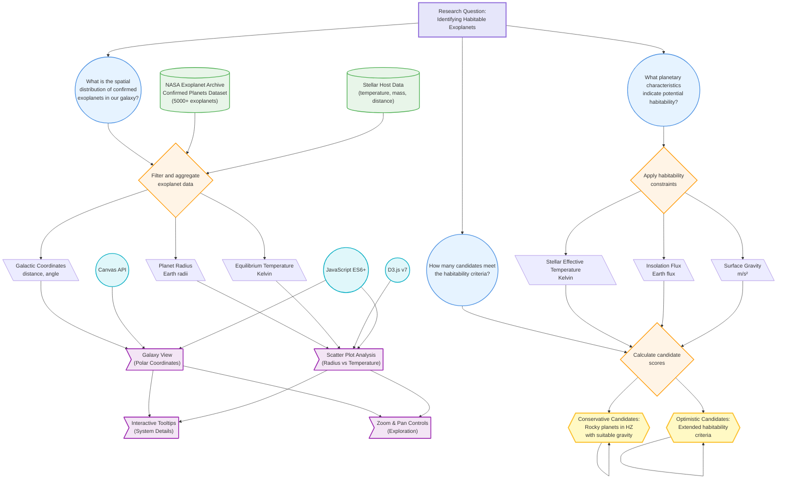

# Protocol Diagram: Exoplanet Habitability Visualization

## Research Question
**How can we identify and visualize potentially habitable exoplanets based on their physical characteristics and environmental conditions?**

This project explores the distribution of confirmed exoplanets in the galaxy and identifies candidates for habitability by analyzing multiple planetary parameters including size, temperature, orbital characteristics, and stellar properties.

---

## Methodology Overview

Our approach combines data processing, visual analytics, and interactive storytelling to guide users through the discovery process of potentially habitable exoplanets. The visualization employs a stepped narrative structure, progressively filtering and analyzing the dataset to narrow down habitability candidates.

---

## Process Diagram

---

## Detailed Process Description

### 1. Data Acquisition & Preparation

**Dataset:** NASA Exoplanet Archive - Confirmed Planets
- **Source:** [NASA Exoplanet Archive](https://exoplanetarchive.ipac.caltech.edu/)
- **Size:** 5000+ confirmed exoplanets
- **Format:** JSON (preprocessed from CSV)

**Data Processing Steps:**
1. Load raw exoplanet data (`planets.json`) and stellar system data (`systems.json`)
2. Calculate derived properties:
   - Galactic coordinates (distance and angle from solar system)
   - Equilibrium temperatures
   - Rocky planet classification (radius < 1.6 Earth radii)
   - Habitable zone boundaries based on stellar temperature
3. Filter invalid/incomplete records
4. Aggregate planet data by host star system

### 2. Habitability Criteria Definition

**Conservative Candidates:**
- Rocky planet (radius ≤ 1.6 R⊕)
- Within habitable zone (suitable insolation flux)
- Surface gravity similar to Earth (4-15 m/s²)
- Host star temperature: 2,400-7,000 K

**Optimistic Candidates:**
- Extended radius range (up to 2.0 R⊕)
- Broader temperature tolerance
- Relaxed gravity constraints

### 3. Visual Analysis Pipeline

**Step 1: Galaxy Overview**
- **Visualization:** Polar coordinate plot (Canvas)
- **Purpose:** Show spatial distribution of all confirmed exoplanets
- **Encoding:** Distance (radial), angle (galactic longitude), opacity (presence)

**Step 2: Initial Filtering**
- **Visualization:** Galaxy view with opacity encoding
- **Purpose:** Highlight systems with complete data
- **Encoding:** Opacity based on data completeness (6 key parameters)

**Step 3-5: Progressive Filtering**
- **Step 3:** Rocky planets only
- **Step 4:** Temperature constraints applied
- **Step 5:** Gravity constraints applied
- **Encoding:** Increasing opacity for planets meeting each criterion

**Step 6: Candidate Systems**
- **Visualization:** Galaxy view with orbital animations
- **Purpose:** Show final candidate systems with their planets
- **Encoding:** Animated orbits, color-coded by habitability status

**Step 7-9: Detailed Analysis**
- **Visualization:** Scatter plots (D3.js SVG)
- **Axes:** Planet radius vs. equilibrium temperature
- **Zones:** Rocky planet zone, habitable zone, gravity zone
- **Purpose:** Detailed parameter space exploration

### 4. Interactive Features

**Implemented Interactions:**
- **Tooltips:** Hover to see detailed system/planet information
- **Zoom & Pan:** Both galaxy and scatter views support zoom/pan
  - Mouse wheel zoom (centered on cursor)
  - Drag to pan
  - Zoom controls (+/−/reset buttons)
- **Adaptive Axes:** More detail when zoomed in
- **Hover Animations:** Glow effects on hoverable elements
- **Step Navigation:** Linear storytelling with prev/next controls

### 5. Technical Implementation

**Frontend Stack:**
- **D3.js v7:** Scatter plot rendering, scales, axes, zoom behavior
- **Canvas API:** High-performance galaxy view rendering
- **Vanilla JavaScript:** State management, event handling
- **CSS3:** Styling, animations, responsive layout

**Architecture:**
- **State Management:** Centralized state with observer pattern
- **View System:** Separate galaxy (Canvas) and scatter (SVG) views
- **Scene Configuration:** Declarative scene definitions with filters
- **Module Structure:** Separate concerns (data loading, views, UI, state)

**Performance Optimizations:**
- Canvas rendering for 5000+ points in galaxy view
- Debounced resize handlers
- Efficient zoom/pan transforms
- RequestAnimationFrame for smooth animations

---

## Key Findings

### Conservative Habitability Candidates
**Count:** ~50-100 systems
- Rocky planets in traditional habitable zone
- Earth-like surface gravity
- Stable host stars

### Optimistic Habitability Candidates
**Count:** ~100-200 systems
- Extended criteria including super-Earths
- Broader temperature ranges
- Diverse stellar hosts

### Spatial Distribution Insights
- Most exoplanets discovered within 1000-3000 parsecs
- Concentration along galactic plane
- Detection bias toward nearby, bright stars

---

## Visualization Insights

1. **Rocky Planet Bias:** Most confirmed exoplanets are gas giants; rocky planets are relatively rare
2. **Hot Jupiter Prevalence:** Many large planets orbit very close to their stars
3. **Temperature-Size Correlation:** Clear clustering patterns in radius-temperature space
4. **Habitable Zone Overlap:** Small region where all criteria align

---

## References

- NASA Exoplanet Archive: https://exoplanetarchive.ipac.caltech.edu/
- Habitable Zone Calculator: Kopparapu et al. (2013)
- D3.js Documentation: https://d3js.org/
- Project inspired by Climate Imaginaries (Digital Methods Initiative)

---

## Project Repository

**GitHub:** [DDD-2025-Group10](https://github.com/jerem-marti/DDD-2025-Group10)

**Live Demo:** [GitHub Pages](https://jerem-marti.github.io/DDD-2025-Group10/)

---

*Created for Making Sense of Data course, SUPSI MAIND 2025*
